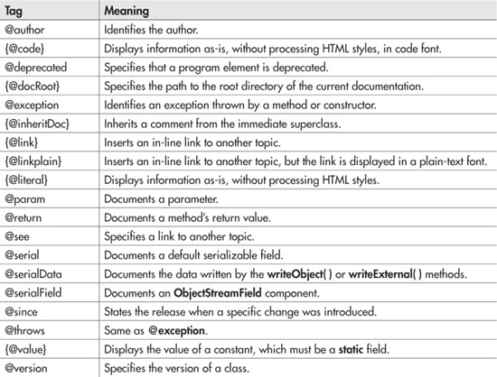

# 
 Java Doc

---

## Assuntos: 
* Documentação Oficial
* Tags
* Tipos de Comentários
* Javadoc

---

### Documentação Oficial

[Documentação Java](https://docs.oracle.com/en/java/)

### Tags

[Fonte:](https://www.oreilly.com/library/view/java-a-beginners/9780071606325/appblev1sec1.html)

Tags são marcadores que representam dados relevantes para a compreensão da proposta de uma classe o os conjuntos de seus métodos e atributos.

### Tipos de Comentários

~~~java
//Comentário em única linha

/*
        Este tipo 
        de comentário
        utiliza mais 
        de uma linha
 */

/**
 * Estas duas estrelinhas acima
 * é para identificar que você
 * pretende elaborar um comentário
 * a nível de documentação.
 */
~~~

### Javadoc
Javadoc é um gerador de documentação criado pela Sun Microsystems , para documentar a API dos programas em Java, a partir do código-fonte. O resultado é expresso em HTML. É constituído, basicamente, por algumas marcações muitos simples, inseridas nos comentários do programa.
Este sistema, é o padrão de documentação de classes em Java, onde muitas das IDEs desta linguagem irão automaticamente gerar um Javadoc em HTML.

~~~java
// No terminal execute o comando abaixo

javadoc -encoding UTF-8 -docencoding ISO-8859-1  -d ../docs  src/*.java
~~~